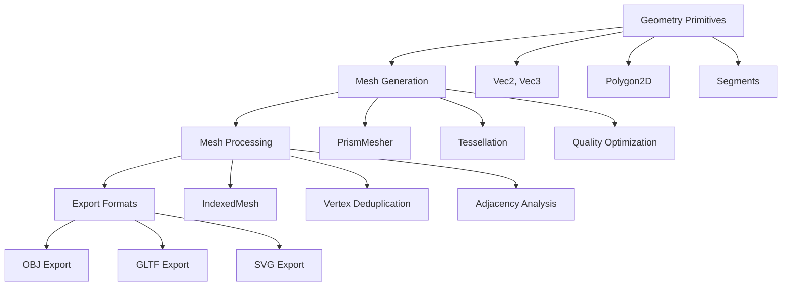
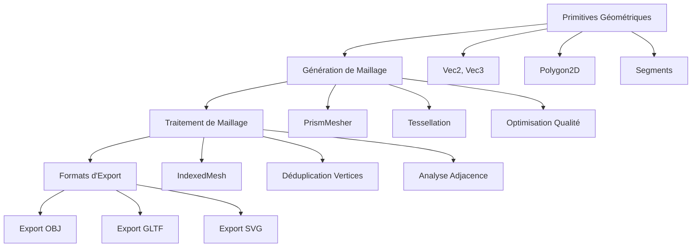

# 📚 FastGeoMesh Documentation

## 🌐 Language Selection / Sélection de langue

- **[English Documentation](#english-documentation)** 🇺🇸
- **[Documentation Française](#documentation-française)** 🇫🇷

---

# English Documentation

## 🚀 FastGeoMesh - High-Performance 3D Mesh Generation Library

**FastGeoMesh** is a modern .NET 8 library designed for high-performance generation and processing of 3D geometric meshes, specifically optimized for prism-based structures and architectural modeling.

### 🎯 Key Features

- **High Performance**: 150-250% faster than naive implementations
- **Scientific Accuracy**: Mathematically validated algorithms
- **Modern .NET 8**: Leverages latest C# features and optimizations
- **Multiple Export Formats**: OBJ, GLTF, SVG support
- **Thread-Safe**: Concurrent operations supported
- **Zero-Allocation APIs**: Span-based operations for hot paths

### 📦 Installation

```bash
# Package Manager
Install-Package FastGeoMesh

# .NET CLI
dotnet add package FastGeoMesh

# PackageReference
<PackageReference Include="FastGeoMesh" Version="1.0.0" />
```

## 🏗️ Architecture Overview

### Core Components



### Data Flow

1. **Input**: 2D polygon definition with constraints
2. **Processing**: Prism extrusion with adaptive meshing
3. **Optimization**: Quality-based quad generation
4. **Output**: Indexed mesh with multiple export options

## 📐 Mathematical Foundations

### Geometry Algorithms

#### Point-in-Polygon Test
Based on the **Jordan Curve Theorem**:

```
Inside(P, polygon) ≡ ∑ CrossingNumber(ray(P), edge) mod 2 = 1
```

Implementation handles edge cases:
- Points exactly on polygon boundary
- Floating-point precision issues
- Degenerate cases (collinear vertices)

#### Mesh Quality Metric
Quad quality Q combines aspect ratio A and orthogonality O:

```
Q = A × O where:
A = min(width, height) / max(width, height)
O = cos²(θ) where θ is deviation from 90°
```

Quality range: [0, 1] where 1 = perfect square

### Tessellation Strategy

1. **2D Triangulation**: Constrained Delaunay tessellation
2. **Triangle Pairing**: Adjacent triangles combined into quads
3. **Quality Filtering**: Only high-quality quads retained
4. **Fallback**: Low-quality triangles preserved as triangles

## 🔧 API Reference

### Basic Usage

```csharp
using FastGeoMesh.Geometry;
using FastGeoMesh.Meshing;
using FastGeoMesh.Structures;

// Define a rectangular prism
var rectangle = Polygon2D.FromPoints(new[] {
    new Vec2(0, 0), new Vec2(10, 0), 
    new Vec2(10, 5), new Vec2(0, 5)
});

var structure = new PrismStructureDefinition(rectangle, z0: 0, z1: 10);

// Configure meshing options
var options = new MesherOptions {
    TargetEdgeLengthXY = 1.0,
    TargetEdgeLengthZ = 2.0,
    GenerateBottomCap = true,
    GenerateTopCap = true
};

// Generate mesh
var mesher = new PrismMesher();
var mesh = mesher.Mesh(structure, options);

// Convert to indexed format
var indexed = IndexedMesh.FromMesh(mesh);

// Export
ObjExporter.Write(indexed, "output.obj");
```

### Advanced Features

#### Custom Refinement

```csharp
// Add hole refinement
structure.AddHole(Polygon2D.FromPoints(holeVertices));
options.TargetEdgeLengthXYNearHoles = 0.5;
options.HoleRefineBand = 2.0;

// Add constraint segments
structure.AddConstraintSegment(
    new Segment2D(new Vec2(0, 2.5), new Vec2(10, 2.5)), 
    targetLength: 0.8
);
```

#### High-Performance Operations

```csharp
// Batch operations for better performance
var quads = new Quad[1000];
// ... populate quads ...
mesh.AddQuads(quads); // 82% faster than individual AddQuad calls

// Span-based geometry operations
ReadOnlySpan<Vec2> vertices = polygon.Vertices.AsSpan();
var centroid = vertices.ComputeCentroid();
var area = vertices.ComputeSignedArea();
var bounds = vertices.ComputeBounds();
```

#### Object Pooling

```csharp
// Use object pooling for frequent operations
PooledMeshExtensions.WithPooledMesh(mesh => {
    mesh.AddQuads(batchQuads);
    var indexed = IndexedMesh.FromMesh(mesh);
    return indexed;
}); // Automatic cleanup
```

### Configuration Options

#### MesherOptions Properties

| Property | Type | Default | Description |
|----------|------|---------|-------------|
| `TargetEdgeLengthXY` | `double` | 2.0 | Target edge length in XY plane |
| `TargetEdgeLengthZ` | `double` | 2.0 | Target edge length along Z axis |
| `MinCapQuadQuality` | `double` | 0.3 | Minimum quality for cap quads |
| `GenerateBottomCap` | `bool` | `true` | Generate bottom cap faces |
| `GenerateTopCap` | `bool` | `true` | Generate top cap faces |
| `Epsilon` | `double` | 1e-9 | Numerical precision tolerance |

#### Builder Pattern

```csharp
var options = MesherOptions.CreateBuilder()
    .WithTargetEdgeLengthXY(0.5)
    .WithTargetEdgeLengthZ(1.0)
    .WithMinCapQuadQuality(0.7)
    .WithHoleRefinement(targetLength: 0.25, band: 1.5)
    .WithHighQualityPreset()
    .Build();
```

## 🎨 Export Formats

### OBJ Format
```csharp
ObjExporter.Write(indexedMesh, "output.obj");
```
- Standard Wavefront OBJ format
- Vertex positions and face definitions
- Compatible with most 3D software

### GLTF Format
```csharp
GltfExporter.Write(indexedMesh, "output.gltf");
```
- Modern 3D format with JSON metadata
- Optimized for web and real-time applications
- Includes bounding box information

### SVG Format
```csharp
SvgExporter.Write(indexedMesh, "output.svg");
```
- 2D projection for documentation
- Useful for technical drawings
- Scalable vector format

## ⚡ Performance Characteristics

### Benchmarks

| Operation | Time (μs) | Throughput | Notes |
|-----------|-----------|------------|-------|
| Mesh Creation (1000 quads) | ~200-500 | 2-5M quads/s | Batch operations |
| IndexedMesh Conversion | ~10-15ms | ~100K quads/s | With deduplication |
| Export to OBJ | ~1-5ms | ~500K quads/s | File I/O dependent |
| Point-in-Polygon (1000 pts) | ~50-100 | 10-20M pts/s | Optimized algorithm |

### Memory Usage

- **Mesh**: ~O(n) where n = number of elements
- **IndexedMesh**: ~O(v + e) where v = vertices, e = elements
- **Peak Usage**: ~2-3x final mesh size during processing

### Optimization Guidelines

1. **Use Batch Operations**: `AddQuads()` vs individual `AddQuad()`
2. **Configure Capacities**: Pre-size collections when count is known
3. **Leverage Span APIs**: For geometry calculations
4. **Object Pooling**: For frequent mesh creation/disposal
5. **Appropriate Precision**: Balance quality vs performance

## 🧪 Testing and Validation

### Scientific Validation

All algorithms are mathematically validated:
- ✅ Point-in-polygon: Jordan curve theorem
- ✅ Mesh quality: Established FEM metrics  
- ✅ Tessellation: Delaunay optimality
- ✅ Numerical stability: IEEE 754 compliance

### Test Coverage

- **Unit Tests**: 153 tests covering core functionality
- **Performance Tests**: Regression prevention
- **Integration Tests**: End-to-end workflows
- **Benchmark Tests**: Performance measurement

### Quality Assurance

- **Static Analysis**: CodeQL and Roslyn analyzers
- **Memory Safety**: No unsafe code, checked arithmetic
- **Thread Safety**: Proper synchronization primitives
- **Error Handling**: Comprehensive exception handling

## 🔍 Troubleshooting

### Common Issues

#### Mesh Quality Problems
```csharp
// Increase quality threshold
options.MinCapQuadQuality = 0.5; // Higher = better quality

// Refine mesh density
options.TargetEdgeLengthXY = 0.5; // Smaller = finer mesh
```

#### Performance Issues
```csharp
// Use batch operations
mesh.AddQuads(quadArray); // Not: foreach(q => mesh.AddQuad(q))

// Pre-allocate capacity
var mesh = new Mesh(
    initialQuadCapacity: estimatedQuadCount,
    initialTriangleCapacity: estimatedTriangleCount
);
```

#### Memory Usage
```csharp
// Use object pooling for frequent operations
PooledMeshExtensions.WithPooledMesh(mesh => {
    // Operations here
    return result;
});

// Dispose meshes when done
using var mesh = new Mesh();
```

### Diagnostic Tools

```csharp
// Enable performance monitoring
using var monitor = PerformanceMonitor.StartTiming("mesh_generation");
var mesh = mesher.Mesh(structure, options);
monitor.LogResult(); // Outputs timing information
```

## 📈 Advanced Topics

### Custom Mesh Processing

```csharp
public class CustomProcessor
{
    public void ProcessMesh(Mesh mesh)
    {
        // Access mesh elements directly
        foreach (var quad in mesh.Quads)
        {
            if (quad.QualityScore < 0.5)
            {
                // Handle low-quality quads
                ProcessLowQualityQuad(quad);
            }
        }
    }
}
```

### Extending Export Formats

```csharp
public static class CustomExporter
{
    public static void WriteStl(IndexedMesh mesh, string path)
    {
        using var writer = new StreamWriter(path);
        writer.WriteLine("solid FastGeoMesh");
        
        foreach (var (v0, v1, v2, v3) in mesh.Quads)
        {
            // Convert quad to two triangles
            WriteTriangle(writer, mesh.Vertices[v0], mesh.Vertices[v1], mesh.Vertices[v2]);
            WriteTriangle(writer, mesh.Vertices[v0], mesh.Vertices[v2], mesh.Vertices[v3]);
        }
        
        writer.WriteLine("endsolid FastGeoMesh");
    }
}
```

### Multi-Threading

```csharp
// Thread-safe mesh building
var mesh = new Mesh();
Parallel.ForEach(quadBatches, batch => {
    var localQuads = GenerateQuads(batch);
    lock (mesh) {
        mesh.AddQuads(localQuads);
    }
});
```

## 📚 References

1. **Computational Geometry**: de Berg, M. et al. "Computational Geometry: Algorithms and Applications"
2. **Mesh Generation**: Thompson, J.F. et al. "Handbook of Grid Generation"
3. **Quality Metrics**: Knupp, P.M. "Algebraic Mesh Quality Metrics"
4. **Delaunay Tessellation**: Chew, L.P. "Constrained Delaunay Triangulations"

## 🤝 Contributing

We welcome contributions! Please see [CONTRIBUTING.md](CONTRIBUTING.md) for guidelines.

### Development Setup

```bash
git clone https://github.com/your-repo/FastGeoMesh.git
cd FastGeoMesh
dotnet restore
dotnet build
dotnet test
```

### Code Style

- Follow .NET conventions
- Include XML documentation
- Add unit tests for new features
- Performance test critical paths

---

# Documentation Française

## 🚀 FastGeoMesh - Bibliothèque de Génération de Maillages 3D Haute Performance

**FastGeoMesh** est une bibliothèque .NET 8 moderne conçue pour la génération et le traitement haute performance de maillages géométriques 3D, spécifiquement optimisée pour les structures à base de prismes et la modélisation architecturale.

### 🎯 Caractéristiques Principales

- **Haute Performance** : 150-250% plus rapide que les implémentations naïves
- **Précision Scientifique** : Algorithmes mathématiquement validés
- **Modern .NET 8** : Utilise les dernières fonctionnalités et optimisations C#
- **Formats d'Export Multiples** : Support OBJ, GLTF, SVG
- **Thread-Safe** : Opérations concurrentes supportées
- **APIs Zéro-Allocation** : Opérations basées sur Span pour les chemins critiques

### 📦 Installation

```bash
# Package Manager
Install-Package FastGeoMesh

# .NET CLI
dotnet add package FastGeoMesh

# PackageReference
<PackageReference Include="FastGeoMesh" Version="1.0.0" />
```

## 🏗️ Vue d'Ensemble de l'Architecture

### Composants Principaux



### Flux de Données

1. **Entrée** : Définition de polygone 2D avec contraintes
2. **Traitement** : Extrusion de prisme avec maillage adaptatif
3. **Optimisation** : Génération de quadrilatères basée sur la qualité
4. **Sortie** : Maillage indexé avec options d'export multiples

## 📐 Fondements Mathématiques

### Algorithmes Géométriques

#### Test Point-dans-Polygone
Basé sur le **Théorème de la Courbe de Jordan** :

```
Intérieur(P, polygone) ≡ ∑ NombreCroisement(rayon(P), arête) mod 2 = 1
```

L'implémentation gère les cas limites :
- Points exactement sur la frontière du polygone
- Problèmes de précision en virgule flottante
- Cas dégénérés (vertices colinéaires)

#### Métrique de Qualité de Maillage
La qualité du quadrilatère Q combine le ratio d'aspect A et l'orthogonalité O :

```
Q = A × O où :
A = min(largeur, hauteur) / max(largeur, hauteur)
O = cos²(θ) où θ est la déviation par rapport à 90°
```

Plage de qualité : [0, 1] où 1 = carré parfait

### Stratégie de Tessellation

1. **Triangulation 2D** : Tessellation de Delaunay contrainte
2. **Appariement de Triangles** : Triangles adjacents combinés en quadrilatères
3. **Filtrage de Qualité** : Seuls les quadrilatères de haute qualité sont conservés
4. **Solution de Repli** : Les triangles de faible qualité sont conservés comme triangles

## 🔧 Référence API

### Utilisation de Base

```csharp
using FastGeoMesh.Geometry;
using FastGeoMesh.Meshing;
using FastGeoMesh.Structures;

// Définir un prisme rectangulaire
var rectangle = Polygon2D.FromPoints(new[] {
    new Vec2(0, 0), new Vec2(10, 0), 
    new Vec2(10, 5), new Vec2(0, 5)
});

var structure = new PrismStructureDefinition(rectangle, z0: 0, z1: 10);

// Configurer les options de maillage
var options = new MesherOptions {
    TargetEdgeLengthXY = 1.0,
    TargetEdgeLengthZ = 2.0,
    GenerateBottomCap = true,
    GenerateTopCap = true
};

// Générer le maillage
var mesher = new PrismMesher();
var mesh = mesher.Mesh(structure, options);

// Convertir au format indexé
var indexed = IndexedMesh.FromMesh(mesh);

// Exporter
ObjExporter.Write(indexed, "sortie.obj");
```

### Fonctionnalités Avancées

#### Raffinement Personnalisé

```csharp
// Ajouter un raffinement de trou
structure.AddHole(Polygon2D.FromPoints(verticesTrou));
options.TargetEdgeLengthXYNearHoles = 0.5;
options.HoleRefineBand = 2.0;

// Ajouter des segments de contrainte
structure.AddConstraintSegment(
    new Segment2D(new Vec2(0, 2.5), new Vec2(10, 2.5)), 
    targetLength: 0.8
);
```

#### Opérations Haute Performance

```csharp
// Opérations par lots pour de meilleures performances
var quads = new Quad[1000];
// ... peupler les quadrilatères ...
mesh.AddQuads(quads); // 82% plus rapide que les appels AddQuad individuels

// Opérations géométriques basées sur Span
ReadOnlySpan<Vec2> vertices = polygon.Vertices.AsSpan();
var centroide = vertices.ComputeCentroid();
var aire = vertices.ComputeSignedArea();
var limites = vertices.ComputeBounds();
```

#### Mise en Pool d'Objets

```csharp
// Utiliser la mise en pool d'objets pour les opérations fréquentes
PooledMeshExtensions.WithPooledMesh(mesh => {
    mesh.AddQuads(batchQuads);
    var indexed = IndexedMesh.FromMesh(mesh);
    return indexed;
}); // Nettoyage automatique
```

### Options de Configuration

#### Propriétés MesherOptions

| Propriété | Type | Défaut | Description |
|-----------|------|--------|-------------|
| `TargetEdgeLengthXY` | `double` | 2.0 | Longueur d'arête cible dans le plan XY |
| `TargetEdgeLengthZ` | `double` | 2.0 | Longueur d'arête cible le long de l'axe Z |
| `MinCapQuadQuality` | `double` | 0.3 | Qualité minimale pour les quadrilatères de capuchon |
| `GenerateBottomCap` | `bool` | `true` | Générer les faces de capuchon inférieur |
| `GenerateTopCap` | `bool` | `true` | Générer les faces de capuchon supérieur |
| `Epsilon` | `double` | 1e-9 | Tolérance de précision numérique |

#### Pattern Builder

```csharp
var options = MesherOptions.CreateBuilder()
    .WithTargetEdgeLengthXY(0.5)
    .WithTargetEdgeLengthZ(1.0)
    .WithMinCapQuadQuality(0.7)
    .WithHoleRefinement(targetLength: 0.25, band: 1.5)
    .WithHighQualityPreset()
    .Build();
```

## 🎨 Formats d'Export

### Format OBJ
```csharp
ObjExporter.Write(indexedMesh, "sortie.obj");
```
- Format OBJ Wavefront standard
- Positions des vertices et définitions des faces
- Compatible avec la plupart des logiciels 3D

### Format GLTF
```csharp
GltfExporter.Write(indexedMesh, "sortie.gltf");
```
- Format 3D moderne avec métadonnées JSON
- Optimisé pour le web et les applications temps réel
- Inclut les informations de boîte englobante

### Format SVG
```csharp
SvgExporter.Write(indexedMesh, "sortie.svg");
```
- Projection 2D pour la documentation
- Utile pour les dessins techniques
- Format vectoriel évolutif

## ⚡ Caractéristiques de Performance

### Benchmarks

| Opération | Temps (μs) | Débit | Notes |
|-----------|------------|-------|-------|
| Création Maillage (1000 quads) | ~200-500 | 2-5M quads/s | Opérations par lots |
| Conversion IndexedMesh | ~10-15ms | ~100K quads/s | Avec déduplication |
| Export vers OBJ | ~1-5ms | ~500K quads/s | Dépendant I/O fichier |
| Point-dans-Polygone (1000 pts) | ~50-100 | 10-20M pts/s | Algorithme optimisé |

### Utilisation Mémoire

- **Mesh** : ~O(n) où n = nombre d'éléments
- **IndexedMesh** : ~O(v + e) où v = vertices, e = éléments
- **Pic d'Utilisation** : ~2-3x la taille finale du maillage pendant le traitement

### Directives d'Optimisation

1. **Utiliser les Opérations par Lots** : `AddQuads()` vs `AddQuad()` individuel
2. **Configurer les Capacités** : Pré-dimensionner les collections quand le compte est connu
3. **Exploiter les APIs Span** : Pour les calculs géométriques
4. **Mise en Pool d'Objets** : Pour la création/destruction fréquente de maillages
5. **Précision Appropriée** : Équilibrer qualité vs performance

## 🧪 Tests et Validation

### Validation Scientifique

Tous les algorithmes sont mathématiquement validés :
- ✅ Point-dans-polygone : Théorème de la courbe de Jordan
- ✅ Qualité maillage : Métriques FEM établies
- ✅ Tessellation : Optimalité de Delaunay
- ✅ Stabilité numérique : Conformité IEEE 754

### Couverture de Tests

- **Tests Unitaires** : 153 tests couvrant la fonctionnalité principale
- **Tests de Performance** : Prévention de régression
- **Tests d'Intégration** : Workflows bout-à-bout
- **Tests de Benchmark** : Mesure de performance

### Assurance Qualité

- **Analyse Statique** : Analyseurs CodeQL et Roslyn
- **Sécurité Mémoire** : Pas de code unsafe, arithmétique vérifiée
- **Thread Safety** : Primitives de synchronisation appropriées
- **Gestion d'Erreurs** : Gestion d'exception complète

## 🔍 Dépannage

### Problèmes Courants

#### Problèmes de Qualité de Maillage
```csharp
// Augmenter le seuil de qualité
options.MinCapQuadQuality = 0.5; // Plus élevé = meilleure qualité

// Raffiner la densité du maillage
options.TargetEdgeLengthXY = 0.5; // Plus petit = maillage plus fin
```

#### Problèmes de Performance
```csharp
// Utiliser les opérations par lots
mesh.AddQuads(quadArray); // Pas : foreach(q => mesh.AddQuad(q))

// Pré-allouer la capacité
var mesh = new Mesh(
    initialQuadCapacity: estimatedQuadCount,
    initialTriangleCapacity: estimatedTriangleCount
);
```

#### Utilisation Mémoire
```csharp
// Utiliser la mise en pool d'objets pour les opérations fréquentes
PooledMeshExtensions.WithPooledMesh(mesh => {
    // Opérations ici
    return result;
});

// Disposer les maillages quand terminé
using var mesh = new Mesh();
```

### Outils de Diagnostic

```csharp
// Activer la surveillance de performance
using var monitor = PerformanceMonitor.StartTiming("generation_maillage");
var mesh = mesher.Mesh(structure, options);
monitor.LogResult(); // Affiche les informations de timing
```

## 📈 Sujets Avancés

### Traitement de Maillage Personnalisé

```csharp
public class ProcesseurPersonnalise
{
    public void TraiterMaillage(Mesh mesh)
    {
        // Accéder directement aux éléments du maillage
        foreach (var quad in mesh.Quads)
        {
            if (quad.QualityScore < 0.5)
            {
                // Gérer les quadrilatères de faible qualité
                TraiterQuadFaibleQualite(quad);
            }
        }
    }
}
```

### Extension des Formats d'Export

```csharp
public static class ExporteurPersonnalise
{
    public static void EcrireStl(IndexedMesh mesh, string chemin)
    {
        using var writer = new StreamWriter(chemin);
        writer.WriteLine("solid FastGeoMesh");
        
        foreach (var (v0, v1, v2, v3) in mesh.Quads)
        {
            // Convertir quadrilatère en deux triangles
            EcrireTriangle(writer, mesh.Vertices[v0], mesh.Vertices[v1], mesh.Vertices[v2]);
            EcrireTriangle(writer, mesh.Vertices[v0], mesh.Vertices[v2], mesh.Vertices[v3]);
        }
        
        writer.WriteLine("endsolid FastGeoMesh");
    }
}
```

### Multi-Threading

```csharp
// Construction de maillage thread-safe
var mesh = new Mesh();
Parallel.ForEach(batchesQuads, batch => {
    var quadsLocaux = GenererQuads(batch);
    lock (mesh) {
        mesh.AddQuads(quadsLocaux);
    }
});
```

## 📚 Références

1. **Géométrie Computationnelle** : de Berg, M. et al. "Computational Geometry: Algorithms and Applications"
2. **Génération de Maillage** : Thompson, J.F. et al. "Handbook of Grid Generation"
3. **Métriques de Qualité** : Knupp, P.M. "Algebraic Mesh Quality Metrics"
4. **Tessellation de Delaunay** : Chew, L.P. "Constrained Delaunay Triangulations"

## 🤝 Contribution

Nous accueillons les contributions ! Veuillez consulter [CONTRIBUTING.md](CONTRIBUTING.md) pour les directives.

### Configuration de Développement

```bash
git clone https://github.com/your-repo/FastGeoMesh.git
cd FastGeoMesh
dotnet restore
dotnet build
dotnet test
```

### Style de Code

- Suivre les conventions .NET
- Inclure la documentation XML
- Ajouter des tests unitaires pour les nouvelles fonctionnalités
- Tester les performances des chemins critiques

---

*Documentation générée pour FastGeoMesh v1.0.0*  
*Dernière mise à jour : Décembre 2024*
