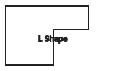
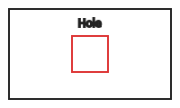

# FastGeoMesh


[](LICENSE)
[](https://github.com/MabinogiCode/FastGeoMesh/actions/workflows/ci.yml)
[](https://www.nuget.org/packages/FastGeoMesh)
 

Lightweight quad meshing for generic prismatic volumes defined by a 2D footprint (plan view) and base/top elevations. Focus: simple, deterministic, dependency‑light.

## Documentation
Full documentation index: [docs/toc.md](docs/toc.md)

Preview (real generated SVG + examples):
<p>
  
  
  
</p>

## Features
- Prism mesher (counter‑clockwise quads on all faces)
  - Side faces: XY subdivision via `TargetEdgeLengthXY`
  - Vertical subdivision: `TargetEdgeLengthZ` + constraint Z levels + geometry Z levels
- Caps (top / bottom)
  - Rectangle fast‑path: structured grid with optional local refinement near holes / near geometry segments
  - Generic path: LibTessDotNet triangulation + quadification (quality‑filtered)
  - Optionally keep leftover low‑quality cap faces as real triangles (no degenerate quads) via `OutputRejectedCapTriangles`
- Quality
  - `Quad.QualityScore` for cap quads (null on side faces)
  - `MinCapQuadQuality` (default 0.75) threshold
- Geometry integration
  - Arbitrary points and 3D segments carried through (for later processing / exports)
  - Constraint segments at a Z force insertion of that Z level
- IndexedMesh utilities
  - Vertex / edge / quad / triangle arrays, adjacency builder
  - Simple text format IO (points / edges / quads with 1‑based ids)
- Exporters
  - OBJ (quads + triangles)
  - glTF 2.0 (.gltf, embedded base64 buffer; quads & triangles written as triangles)
  - SVG top view (edges only)
- Tests: shape variants, holes/refinement, adjacency, quad quality, exporters

## Exporters
FastGeoMesh can export the generated mesh to common 2D/3D formats:

- **OBJ** (Wavefront) — quad + triangle faces  
- **glTF 2.0** — always triangles (quads are split)  
- **SVG** — top‑view 2D vector export (edges)  

```csharp
// Assuming 'indexed' is an IndexedMesh
using FastGeoMesh.Meshing.Exporters;

ObjExporter.Write(indexed, "mesh.obj");
GltfExporter.Write(indexed, "mesh.gltf");
SvgExporter.Write(indexed, "mesh.svg");
```

## Install / Build
- .NET 8 SDK required
- `dotnet build`
- `dotnet test`
- `dotnet pack src/FastGeoMesh/FastGeoMesh.csproj -c Release`

## Quick start
```csharp
using FastGeoMesh.Geometry;
using FastGeoMesh.Meshing;
using FastGeoMesh.Structures;
using FastGeoMesh.Meshing.Exporters;

// Footprint (CCW)
var poly = Polygon2D.FromPoints(new[] {
    new Vec2(0,0), new Vec2(20,0), new Vec2(20,5), new Vec2(0,5)
});

// Prism definition
var structure = new PrismStructureDefinition(poly, z0: -10, z1: 10);

// Optional: constraint level at Z=2.5 along one footprint edge
structure.AddConstraintSegment(new Segment2D(new Vec2(0,0), new Vec2(20,0)), 2.5);

// Optional: reference geometry (points + segment)
structure.Geometry
    .AddPoint(new Vec3(0, 4, 2))
    .AddPoint(new Vec3(20, 4, 4))
    .AddSegment(new Segment3D(new Vec3(0, 4, 2), new Vec3(20, 4, 4)));

var options = new MesherOptions
{
    TargetEdgeLengthXY = 0.5,
    TargetEdgeLengthZ = 1.0,
    HoleRefineBand = 1.0,
    SegmentRefineBand = 1.0,
    TargetEdgeLengthXYNearHoles = 0.25,
    TargetEdgeLengthXYNearSegments = 0.25,
    MinCapQuadQuality = 0.75,
    OutputRejectedCapTriangles = true // keep leftover triangles explicitly
};

var mesh = new PrismMesher().Mesh(structure, options);
var indexed = IndexedMesh.FromMesh(mesh, options.Epsilon);
indexed.WriteCustomTxt("mesh.txt");

ObjExporter.Write(indexed, "mesh.obj");
GltfExporter.Write(indexed, "mesh.gltf");
SvgExporter.Write(indexed, "mesh.svg");
```

## Key options
- `TargetEdgeLengthXY` / `TargetEdgeLengthZ`: base subdivision targets
- `GenerateBottomCap` / `GenerateTopCap`: independently toggle caps
- `HoleRefineBand`, `SegmentRefineBand`: refinement influence distance (rectangle fast‑path only)
- `TargetEdgeLengthXYNearHoles`, `TargetEdgeLengthXYNearSegments`: finer local XY target (≤ base)
- `MinCapQuadQuality`: [0..1] min score to accept triangle pair into a quad (generic cap path)
- `OutputRejectedCapTriangles`: emit unmatched cap triangles instead of forming degenerate quads
- `Epsilon`: coordinate dedup / level comparison tolerance (default 1e-9)

## Quality score (caps)
Weighted blend (aspect, orthogonality, non‑degenerate area). Stored per cap quad for downstream filtering.

## Indexed text format
```
<pointCount>
 id x y z
 ... (pointCount lines)
<edgeCount>
 id a b
 ... (edgeCount lines)  # 1-based vertex indices
<quadCount>
 id v0 v1 v2 v3
 ... (quadCount lines)
```

## Roadmap
See ROADMAP.md

## License
MIT (see LICENSE)
